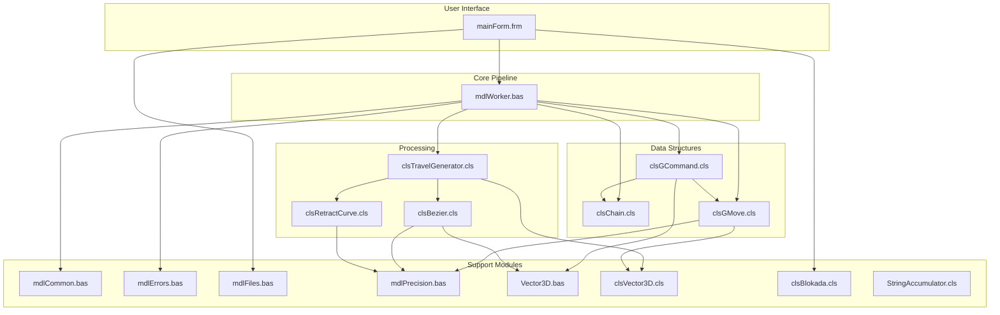
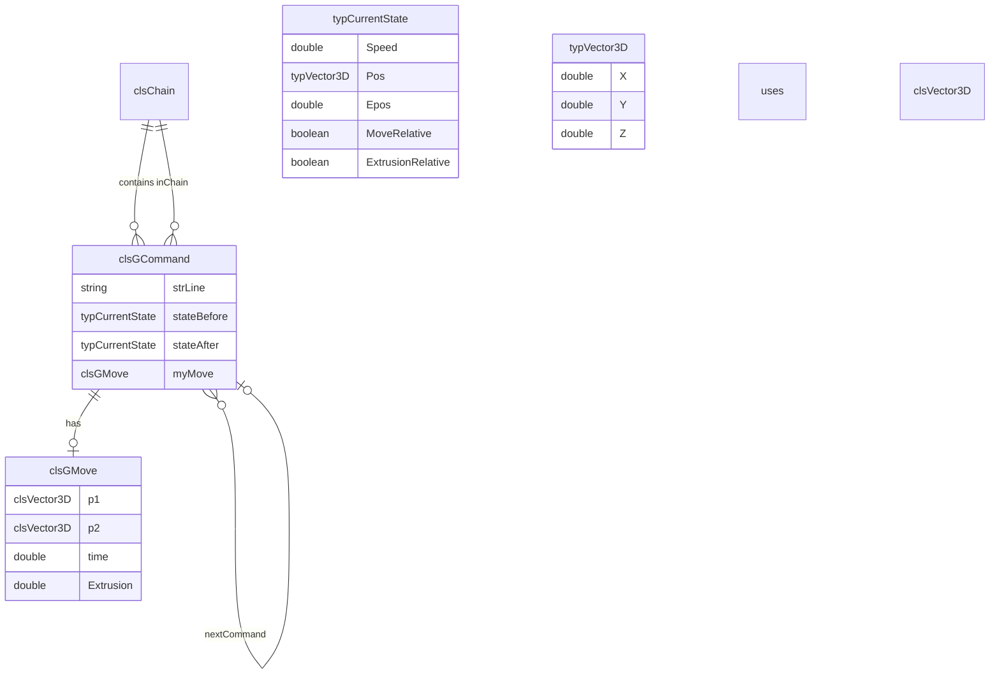

# SplineTravel VB6 - Architecture and Data Flow

## Entry Point

Processing starts when the user clicks **Go** on the main form:

1. `mainForm.cmdProcessFile_Click`
2. Calls `SavePreset "(last used)", includeFilenames:=True`
3. Calls `mdlWorker.Process Me.txtFNIn.Text, Me.txtFNOut.Text, Me`

The `Process` subroutine in `mdlWorker.bas` orchestrates the entire pipeline.

## Module Dependency Graph

## Group Classification

Commands are classified into three group types:

| Type | Enum | Description |
|------|------|-------------|
| Other | `ectOther` | G4, M82, M83, G90, G91, G92, etc. Setup and non-move commands |
| Build chain | `ectBuildChain` | XY travel with positive E (extrusion) |
| Travel chain | `ectTravelChain` | Travel moves (no extrusion) or extruder-only moves (retract/unretract) |

Classification rules (in `mdlWorker.Process`):

- **Build move**: `cmd.isBuildMove` — XY motion + positive E
- **Travel move**: `cmd.isTravelMove` — XY motion, no E
- **Extruder move**: `cmd.isExtruderMove` — E change only (e.g. retract/unretract)
- **Other**: Everything else

When the command type changes, a new group is started. Consecutive commands of the same type stay in the same group.

## Chain Splitting and Reassembly

The original G-code is read into a single `clsChain` (doubly linked list of `clsGCommand`). Then:

1. **Classification pass**: Walk the chain, assign each command to a group, record `firstMoveRef` and `lastMoveRef` per group.
2. **Split**: Call `chain.withdrawChain(c1, c2, preserveLinks:=True)` for each group, producing a separate `clsChain` per group.
3. **Process**: Apply seam concealment to build groups; replace travel groups with spline or straight travel.
4. **Reassemble**: Write groups back to file in order. Groups remain separate chains but are written sequentially.

`clsChain.withdrawChain` extracts a contiguous range of commands into a new chain, optionally preserving prev/next links across the gap (for inter-chain navigation).

## Data Structure Relationships

## Key Types

### typCurrentState (mdlCommon.bas)

Represents machine state after a command:

- **Speed** (mm/s)
- **Pos** — `typVector3D` (X, Y, Z)
- **Epos** — extrusion accumulator (filament length)
- **MoveRelative** — G91 mode
- **ExtrusionRelative** — M83 mode

### typVector3D (Vector3D.bas)

Value type for 3D position/vector: X, Y, Z (Double).

### typMoveChain (mdlWorker.bas, private)

Per-group metadata:

- **chain** — `clsChain` of commands in the group
- **chType** — `ectOther`, `ectBuildChain`, or `ectTravelChain`
- **firstMoveRef**, **lastMoveRef** — references to first/last move command
- **retractInjected**, **unretractInjected** — flags set by seam concealment

### typTravelMoveRef (mdlWorker.bas, private)

Context for travel replacement:

- **prevBuildMoveEnd** — last command of preceding build group
- **firstTravelMove** — first travel command in the group
- **nextBuildMoveBegin** — first command of following build group

Used to get entry/exit positions and speeds for spline fitting, and to re-link chains after travel replacement.
