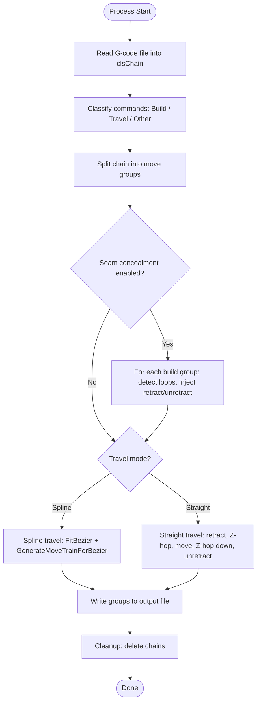
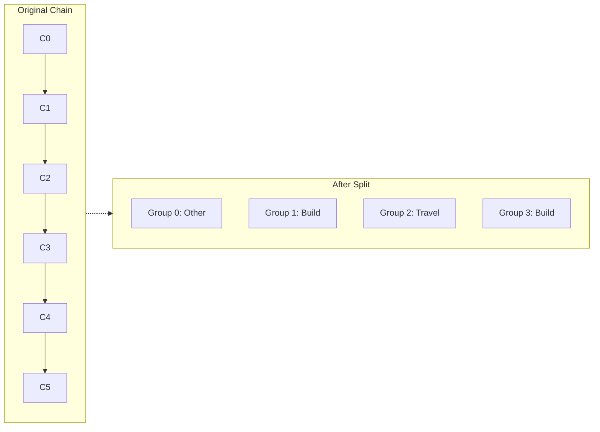
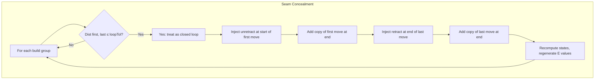
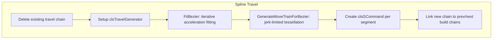
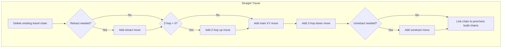
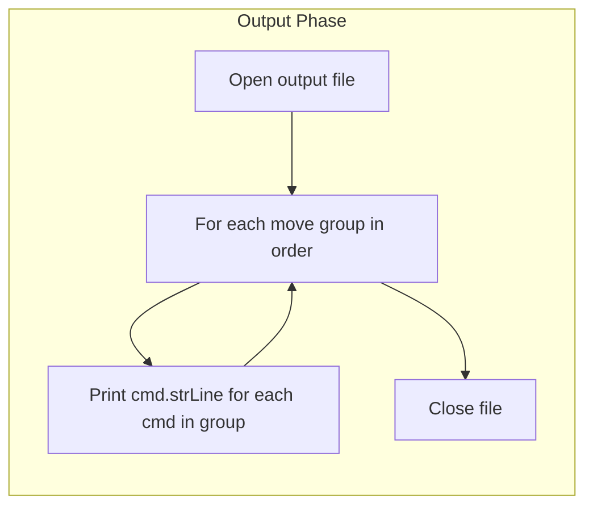

# SplineTravel VB6 - Processing Pipeline Detail

## High-Level Flowchart

## Group Detection Algorithm

1. Initialize `moveGroups(0)` as `ectOther` (dummy group for setup commands).
2. Walk `chain` from first to last command.
3. For each command:
   - Compute `curCmdType`: Build, Travel, or Other.
   - If `curCmdType <> Other`:
     - If `curCmdType <> moveGroups(nMoveGroups-1).chType`: start new group, set `firstMoveRef` and `lastMoveRef`.
     - Else: update `lastMoveRef` for current group.
4. After the pass, `moveGroups` holds 0..n groups in sequence.

## Splitting the Chain

For each group `iGroup`, withdraw from `c1` to `c2`:

- `c1` = first command of group (or `chain.first` for group 0)
- `c2` = last command of group (or `chain.last` for last group)

`chain.withdrawChain(c1, c2, preserveLinks:=True)` returns a new chain containing those commands; the original chain is updated to remove them.

## Seam Concealment Loop

**Parameters:**

- `loopTol` — loop detection tolerance (default 0.3 mm)
- `retractTime` — `retract / retractSpeed` (for concealed retraction)
- `retractSpeed` — speed of concealed retraction (default 8 mm/s)

**Logic (simplified):**

1. Compare `firstMoveRef.CompleteStateBefore.Pos` with `lastMoveRef.CompleteStateAfter.Pos`.
2. If distance ≤ `loopTol`, treat as a closed loop.
3. Walk moves in the group; track remaining time for unretract/retract.
4. Inject unretract at start (first part of first move), retract at end (last part of last move).
5. Split moves if needed; duplicate moves at end to preserve extrusion.
6. Recompute all states with `preserveDeltaE:=True` and regenerate G-code strings.

## Spline Travel Branch

**Setup values:** acceleration, CurveJerk, speedLimit, Retract, RetractAcceleration, RetractJerk, ZJerk.

**Bezier fitting:** See [05-algorithms.md](05-algorithms.md).

**Output:** Array of `clsGMove` → converted to `clsGCommand` → written as G1 lines.

## Straight Travel Branch

**Sequence:**

1. Retract (optional): E-only move, negative extrusion at `txtRSpeedStraight`
2. Z-hop up (optional): Z-only move, Z += ZHop, speed = `txtSpeedStraight`
3. Main move: XY travel (Z includes Z-hop), speed = `txtSpeedStraight`
4. Z-hop down (optional): Z-only move, Z back to target
5. Unretract (optional): E-only move, positive extrusion at `txtRSpeedStraight`

## Output Phase

For each group, iterate `chain.first` → `chain.last` via `nextCommand`, and write `cmd.strLine` for each line.
