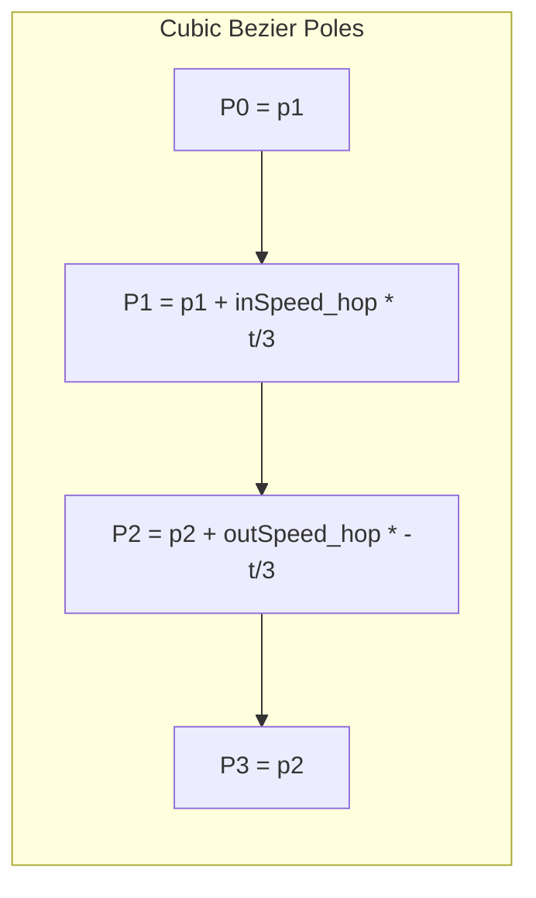
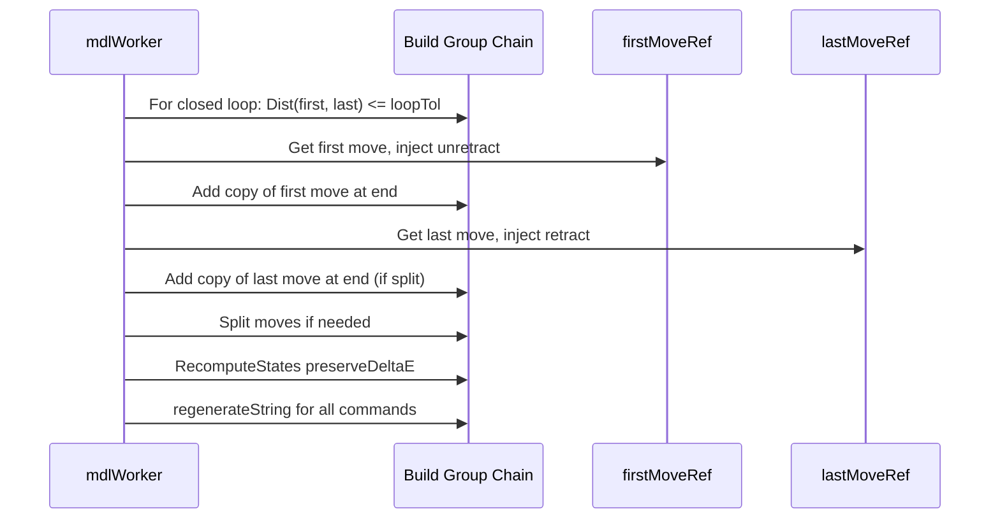

# SplineTravel VB6 - Core Algorithms

## Bezier Fitting (clsTravelGenerator.FitBezier)

**Purpose:** Fit a cubic Bezier curve between two points with given entry/exit velocities and acceleration limit.

### Inputs

- `p1`, `p2` — start and end positions
- `inSpeed`, `outSpeed` — entry and exit velocity vectors (clsVector3D)
- `acceleration` — max acceleration (mm/s²)
- `ZJerk` — Z component added to speeds for hop (inSpeed.Z += ZJerk, outSpeed.Z -= ZJerk)

### Algorithm

1. Compute `spd = max(inSpeed.Length, outSpeed.Length)`. If `spd < CurveJerk`, throw `errTooSlow`.
2. Build `inSpeed_hop`, `outSpeed_hop` with Z component adjusted for hop.
3. Initialize `time` from `stopDist / spd / 10` (abrupt start).
4. Poles: `P0 = p1`, `P3 = p2`.
5. Iterate 30 times:
   - `P1 = p1 + inSpeed_hop * (time/3)`
   - `P2 = p2 + outSpeed_hop * (-time/3)`
   - Compute max acceleration at t=0 and t=1: `acc = getDeriv2(t) / time²`
   - If max ≤ limit: valid spline; `timeOfSolved = time`; decrease time (finer) and `logFactor /= 2`.
   - Else: increase time by `Exp(logFactor)`.
6. Return Bezier and `moveTimeResult = timeOfSolved`.

### Diagram

### Bezier Formula

For t ∈ [0, 1]:

- B(t) = (1-t)³P0 + 3(1-t)²t P1 + 3(1-t)t² P2 + t³ P3
- B'(t) = derivative w.r.t. t
- B''(t) = second derivative w.r.t. t

Physical velocity = B'(t) / time, acceleration = B''(t) / time².

---

## Bezier Tessellation (clsBezier.shrink_interval)

**Purpose:** Compute jerk-limited step size along parameter t.

### Inputs

- `prev_t` — current parameter
- `cur_t` — proposed next parameter (ByRef; may be shrunk)

### Algorithm

1. If invalidated, call `recompute` (update `t_of_low_a`, `max_a`).
2. Get `t_breakpoint = getNextBreakpoint(prev_t)` (default 1).
3. Start `tstep = DerivJerk / max_a` (jerk-limited).
4. Iterate 7 times: increase tstep until jerk exceeds limit; keep last valid tstep.
5. Collapse to breakpoint if `prev_t + tstep > t_breakpoint`.
6. Small-step logic: if step is much smaller than distance to breakpoint, reduce.
7. If `cur_t > prev_t + tstep`, set `cur_t = prev_t + tstep` and return True.

**Jerk:** `jerk = |getDeriv(prev_t + tstep) - getDeriv(prev_t)|` (simplified; actual uses distance between derivative vectors).

---

## Retract Curve (clsRetractCurve)

**Purpose:** Retraction as a function of time; parabolic acceleration/deceleration.

### Phases

| Phase | Time range | Value | Meaning |
|-------|------------|-------|---------|
| Before retract | t < t_start1 | 0 | No retraction |
| Retract accel | t_start1..t_mid1 | parabola up | Accelerating retract |
| Retract decel | t_mid1..t_end1 | parabola down | Decelerating retract |
| Plateau | t_end1..t_start2 | RetractLen | Fully retracted |
| Unretract accel | t_start2..t_mid2 | parabola down | Accelerating unretract |
| Unretract decel | t_mid2..t_end2 | parabola up | Decelerating unretract |
| After | t > t_end2 | 0 | Fully unretracted |

`getValue(t)` returns cumulative retraction (filament length pulled back) at parameter t ∈ [0, 1].

### Time Computation

- `dt_acc = sqrt(2 * (RetractLen/2) / RetractA)` — time for half retract at given acceleration
- If `dt_acc * 4 > MoveTime`: shrink dt_acc and reduce actual RetractLen to fit.
- If only retract or only unretract: adjust dt_acc and RetractA similarly.
- `t_start1 = 0`, `t_mid1 = t_start1 + dt_acc`, `t_end1 = t_mid1 + dt_acc`
- `t_end2 = MoveTime`, `t_mid2 = t_end2 - dt_acc`, `t_start2 = t_mid2 - dt_acc`

### shrink_interval

Similar to Bezier: compute tstep from `DerivJerk / |getDeriv2(prev_t)|`; collapse to breakpoints (t_start1, t_start2); apply small-step logic; shrink cur_t if needed.

---

## Seam Concealment Sequence

**State machine:** `rbsUnRetracting` → walk from first move, inject unretract; when done → `rbsRetracting`, walk from last move, inject retract. Split moves when retract/unretract time spans multiple commands; duplicate affected move at end to preserve extrusion.

**EError:** Separate `EError1`, `EError2` for first and duplicated moves; passed through `setMove` and `split`.
