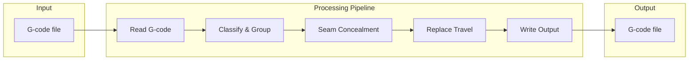

# SplineTravel VB6 - Documentation Index

## Project Purpose

SplineTravel is a **G-code post-processor** for 3D printing that processes G-code programs and:

1. **Replaces straight travel moves with curved (spline) moves** — Uses cubic Bezier curves fitted to entry/exit speed and acceleration limits to avoid full stops between extrusion moves.
2. **Provides seam concealment** — Similar to Slic3r's "Wipe while retracting", but more comprehensive. When start and end of an extrusion loop are close, it injects retract/unretract to make the seam less visible.
3. **Supports two travel modes** — Spline travel (Bezier curves with integrated retraction) or straight travel (retract, Z-hop, move, Z-hop down, unretract).

Designed for slicers such as PrusaSlicer/Slic3r, compatible with standard G-code (G0/G1, M82/M83, G90/G91, G92, etc.).

## PrusaSlicer Integration

Per the [PrusaSlicer post-processing documentation](https://help.prusa3d.com/article/post-processing-scripts_283913):

- The script receives the **absolute path** to a temporary G-code file as the **last argument**.
- It must **read** from that file, **modify** it in place, and **write** the result back to the same file.
- Configure in: **Print settings → Output options → Post-processing scripts**  
  Example: `C:\Path\To\SplineTravel.exe`

For GUI use, input/output paths are chosen manually. For post-processing, SplineTravel would need CLI support to accept the file path as the last argument.

## Feature Summary

| Feature | Description |
|---------|-------------|
| Spline travel | Cubic Bezier curves with jerk-limited tessellation |
| Straight travel | Retract, Z-hop, linear move, Z-hop down, unretract |
| Seam concealment | Detects closed loops; injects unretract at start and retract at end |
| Presets | INI files in `presets\` folder; save/load settings |
| Absolute/relative | Supports G90/G91 and M82/M83 for position and extrusion |

## File Inventory

| File | Type | Purpose |
|------|------|---------|
| `mainForm.frm` | Form | Main UI: presets, travel options, seam concealment, I/O paths |
| `mdlWorker.bas` | Module | Core pipeline: read → group → process → write |
| `mdlCommon.bas` | Module | `typCurrentState`, string helpers (`EscapeString`, `prepad`) |
| `mdlErrors.bas` | Module | Error codes, `Throw`, `PushError`/`PopError`, `MsgError` |
| `mdlFiles.bas` | Module | Preset paths, `getListOfFiles`, `getFileTitle` |
| `mdlPrecision.bas` | Module | Rounding, decimals, confusion thresholds |
| `Vector3D.bas` | Module | `typVector3D` + static math (Dist, Length, Combi2–4, etc.) |
| `clsChain.cls` | Class | Doubly linked list of `clsGCommand` |
| `clsGCommand.cls` | Class | Parsed G-code command, state propagation, move classification |
| `clsGMove.cls` | Class | Geometric move (p1, p2, time, extrusion), G-code generation |
| `clsTravelGenerator.cls` | Class | Bezier fitting, spline tessellation |
| `clsBezier.cls` | Class | Cubic Bezier curve (poles, value, derivatives, `shrink_interval`) |
| `clsRetractCurve.cls` | Class | Retraction as a function of time, jerk-limited stepping |
| `clsVector3D.cls` | Class | 3D vector class with methods |
| `clsBlokada.cls` | Class | Block/unblock mechanism (RAII-style locking) |
| `StringAccumulator.cls` | Class | Efficient string concatenation |

## Architecture Overview

## Document Index

| Document | Description |
|----------|-------------|
| [01-architecture.md](01-architecture.md) | Architecture, module dependencies, data flow |
| [02-processing-pipeline.md](02-processing-pipeline.md) | Processing pipeline detail, flowcharts |
| [03-module-reference.md](03-module-reference.md) | Module and class reference |
| [04-gcode-spec.md](04-gcode-spec.md) | G-code parsing, classification, output |
| [05-algorithms.md](05-algorithms.md) | Bezier fitting, tessellation, seam concealment |
| [06-presets-and-ui.md](06-presets-and-ui.md) | Presets, UI controls, config format |
| [07-errors-and-precision.md](07-errors-and-precision.md) | Error handling, precision constants |
| [08-rewrite-notes.md](08-rewrite-notes.md) | Considerations for rewriting in another language |
